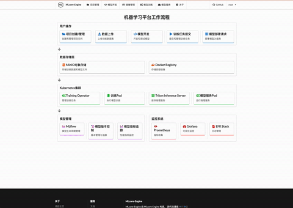

<p align="right">
   <strong>中文</strong> | <a href="./README.md">English</a>
</p> 

# 机器学习平台-AIPlatform-MLcore-Engine

[]()
[]()
[]()

## 项目简介

一个可以快速上手二次开发的AI平台(机器学习平台)脚手架，提供了模型开发、训练和部署流程。采用Go1.22 + gin-v1.10.0后端和 React18.3 + js 前端架构，简单的前后端接口定义和数据结构定义。

## 技术栈

### 后端
- 框架：Gin + GORM
- 存储：MinIO (对象存储) + SQLITE(or MYSQL)
- 容器：Docker + Kubernetes1.23.6 + Docker-Registry
- 模型训练： Training-Operator
- 模型服务：Triton Inference Server
- 监控：Prometheus + Grafana(需要则部署)

### 前端
- 框架：React 18 + JS(建议重构为TS)
- UI：Semantic UI React
- 状态管理：Context
- 请求：Axios
- 图表：Recharts

## 快速开始

### 环境要求
- Go 1.22+
- Node.js v21.7.3 
- Docker 20+
- Kubernetes 1.23.6+
- Npm 10.5.0 


### 本地开发

1. 克隆项目
```bash
git clone https://gitee.com/oldthree260/mlcore-engine
cd ml-platform
```

2. 前端构建
```bash
cd web
npm install
npm run build
```

3. 启动Go程序
```bash
go mod tidy
go run main
访问： http:localhost:3000
```

### 演示
<div align="center">
  
</div>

## API 文档

### 核心数据结构

#### 后端数据结构
```go

//每个controller都采用一致的返回值和请求值

type TrainingJobResponse struct {
	Success bool              `json:"success" example:"true"`
	Message string            `json:"message" example:"Training Job created successfully"`
	Data    model.TrainingJob `json:"data"`
}

type TrainingJobsResponse struct {
	Success bool                 `json:"success" example:"true"`
	Message string               `json:"message" example:""`
	Data    TrainingJobsListData `json:"data"`
}

type TrainingJobsListData struct {
	TrainingJobs []model.TrainingJob `json:"training_jobs"`
	Total        int64               `json:"total" example:"10"`
	Page         int                 `json:"page" example:"1"`
	Limit        int                 `json:"limit" example:"20"`
}

type SuccessResponse struct {
	Success bool   `json:"success" example:"true"`
	Message string `json:"message" example:"Operation successful"`
}

```
####后端代码架构

```shell
MLcore-Engine/
├── common/                     # 通用工具包
│   ├── config.go              # 配置管理
│   ├── constants.go           # 常量定义
│   ├── crypto.go              # 加密工具
│   ├── email.go               # 邮件功能
│   ├── jwt_util.go            # JWT工具
│   ├── logger.go              # 日志管理
│   ├── redis.go               # Redis工具
│   └── utils.go               # 通用工具函数
│
├── controller/                 # API控制器
│   ├── dto.go                 # 数据传输对象
│   ├── project.go             # 项目管理
│   ├── pytorch_job.go         # PyTorch任务
│   ├── triton_deploy.go       # Triton部署
│   └── user.go                # 用户管理
│
├── middleware/                 # 中间件
│   ├── auth.go                # 认证中间件
│   ├── cache.go               # 缓存中间件
│   ├── cors.go                # CORS中间件
│   └── rate_limit.go          # 限流中间件
│
├── model/                     # 数据模型
│   ├── file.go               # 文件模型
│   ├── project.go            # 项目模型
│   ├── pytorchjob.go         # PyTorch任务模型
│   ├── triton_deploy.go      # Triton部署模型
│   └── user.go               # 用户模型
│
├── router/                    # 路由管理
│   ├── api_router.go         # API路由
│   ├── main.go               # 主路由
│   └── web_router.go         # Web路由
│
├── services/                  # 服务层
│   ├── create_pod.go         # Pod创建服务
│   ├── k8s_util.go           # K8s工具
│   ├── pytorch_job_create.go # PyTorch任务创建
│   └── create_triton.go      # Triton服务创建
│
├── docs/                      # 文档目录
├── upload/                    # 上传文件目录
├── vendor/                    # 依赖包
├── web/                      # Web静态资源
│
├── config.yaml               # 配置文件
├── Dockerfile                # Docker构建文件
├── go.mod                    # Go模块文件
├── go.sum                    # Go依赖版本锁定
├── main.go                   # 程序入口
└── README.md                 # 项目说明
```

#### 前端数据结构

```shell

web/                           # 前端根目录
├── build/                     # 构建输出目录
├── public/                    # 静态资源目录
├── src/                      # 源代码目录
│   ├── api/                  # API 接口
│   │   ├── notebookAPI.js    # Notebook相关接口
│   │   ├── projectAPI.js     # 项目相关接口
│   │   ├── trainingAPI.js    # 训练相关接口
│   │   ├── tritonAPI.js      # Triton服务接口
│   │   └── userAPI.js        # 用户相关接口
│   │
│   ├── components/           # 组件目录
│   │   ├── common/           # 通用组件
│   │   ├── Footer/          # 页脚组件
│   │   ├── Header/          # 页头组件
│   │   ├── sidebars/        # 侧边栏组件
│   │   ├── FilesTable.js     # 文件表格组件
│   │   ├── Layout.js         # 布局组件
│   │   ├── Loading.js        # 加载组件
│   │   ├── LoginForm.js      # 登录表单
│   │   ├── RegisterForm.js   # 注册表单
│   │   └── ...              # 其他组件
│   │
│   ├── context/             # Context目录
│   │   ├── Status/          # 状态管理
│   │   ├── AuthContext.js   # 认证上下文
│   │   └── ProjectContext.js # 项目上下文
│   │
│   ├── pages/               # 页面目录
│   │   ├── About/           # 关于页面
│   │   ├── File/            # 文件管理页面
│   │   ├── ModelDevelop/    # 模型开发页面
│   │   ├── Project/         # 项目管理页面
│   │   ├── Serving/         # 服务部署页面
│   │   ├── Setting/         # 设置页面
│   │   ├── Training/        # 训练页面
│   │   ├── User/            # 用户页面
│   │   ├── Home.js          # 首页
│   │   └── NotFound.js      # 404页面
│   │
│   ├── styles/              # 样式文件目录
│   ├── constants/           # 常量定义
│   ├── helpers/             # 辅助函数
│   ├── hooks/               # 自定义Hooks
│   ├── App.js              # 应用入口
│   └── index.js            # 程序入口
│
├── package.json            # 项目依赖配置
├── package-lock.json       # 依赖版本锁定
├── .babelrc               # Babel配置
├── .gitignore             # Git忽略配置
├── Dockerfile             # Docker构建文件
└── README.md              # 项目说明
```


## 学习资料

### Go Gin 教程
1. [Go 快速教程](https://www.runoob.com/go/go-tutorial.html)
2. [Gin](https://gin-gonic.com/zh-cn/docs/quickstart/)

### React JS 教程
1. [React 快速教程](https://www.runoob.com/react/react-tutorial.html)
2. [JS 快速教程](https://www.runoob.com/js/js-tutorial.html)

## 贡献指南

欢迎提交 Pull Request 或 Issue。

## 许可证

Apache License 2.0