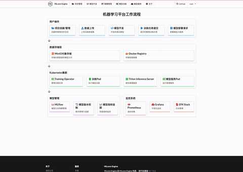

<p align="right">
   <strong>English</strong> | <a href="./README.cn.md">中文</a>
</p> 


# Machine Learning Platform - AIPlatform-MLcore-Engine

[]()
[]()
[]()

## Project Overview

A scaffolding for AI platform (Machine Learning Platform) that enables quick secondary development, providing model development, training, and deployment processes. Built with Go1.22 + gin-v1.10.0 backend and React18.3 + js frontend architecture, featuring simple frontend-backend interface definitions and data structure definitions.

## Technology Stack

### Backend
- Framework: Gin + GORM
- Storage: MinIO (Object Storage) + SQLITE(or MYSQL)
- Container: Docker + Kubernetes1.23.6 + Docker-Registry
- Model Training: Training-Operator
- Model Serving: Triton Inference Server
- Monitoring: Prometheus + Grafana(deploy if needed)

### Frontend
- Framework: React 18 + JS(recommended to refactor to TS)
- UI: Semantic UI React
- State Management: Context
- Request: Axios
- Charts: Recharts

## Quick Start

### Requirements
- Go 1.22+
- Node.js v21.7.3 
- Docker 20+
- Kubernetes 1.23.6+
- Npm 10.5.0 

### Local Development

1. Clone Project
```bash
git clone https://gitee.com/oldthree260/mlcore-engine
cd ml-platform
```

2. Frontend Build
```bash
cd web
npm install
npm run build
```

3. Start Go Program
```bash
go mod tidy
go run main
Access: http:localhost:3000
```

### Demo
<div align="center">
  
</div>

### Detailed Demo
Watch the full demo video:
- [Bilibili](https://www.bilibili.com/video/BV1wBmXYyEae)

## API Documentation

### Core Data Structures

#### Backend Data Structures
```go
// Each controller uses consistent response and request values

type TrainingJobResponse struct {
    Success bool              `json:"success" example:"true"`
    Message string            `json:"message" example:"Training Job created successfully"`
    Data    model.TrainingJob `json:"data"`
}

type TrainingJobsResponse struct {
    Success bool                 `json:"success" example:"true"`
    Message string               `json:"message" example:""`
    Data    TrainingJobsListData `json:"data"`
}

type TrainingJobsListData struct {
    TrainingJobs []model.TrainingJob `json:"training_jobs"`
    Total        int64               `json:"total" example:"10"`
    Page         int                 `json:"page" example:"1"`
    Limit        int                 `json:"limit" example:"20"`
}

type SuccessResponse struct {
    Success bool   `json:"success" example:"true"`
    Message string `json:"message" example:"Operation successful"`
}
```

#### Backend Code Architecture

```shell
MLcore-Engine/
├── common/                     # Common utilities
│   ├── config.go              # Configuration management
│   ├── constants.go           # Constants definition
│   ├── crypto.go              # Encryption tools
│   ├── email.go               # Email functionality
│   ├── jwt_util.go            # JWT utilities
│   ├── logger.go              # Logging management
│   ├── redis.go               # Redis utilities
│   └── utils.go               # Common utility functions
│
├── controller/                 # API controllers
│   ├── dto.go                 # Data transfer objects
│   ├── project.go             # Project management
│   ├── pytorch_job.go         # PyTorch jobs
│   ├── triton_deploy.go       # Triton deployment
│   └── user.go                # User management
│
├── middleware/                 # Middleware
│   ├── auth.go                # Authentication middleware
│   ├── cache.go               # Cache middleware
│   ├── cors.go                # CORS middleware
│   └── rate_limit.go          # Rate limiting middleware
│
├── model/                     # Data models
│   ├── file.go               # File model
│   ├── project.go            # Project model
│   ├── pytorchjob.go         # PyTorch job model
│   ├── triton_deploy.go      # Triton deployment model
│   └── user.go               # User model
│
├── router/                    # Route management
│   ├── api_router.go         # API routes
│   ├── main.go               # Main router
│   └── web_router.go         # Web routes
│
├── services/                  # Services layer
│   ├── create_pod.go         # Pod creation service
│   ├── k8s_util.go           # K8s utilities
│   ├── pytorch_job_create.go # PyTorch job creation
│   └── create_triton.go      # Triton service creation
│
├── docs/                      # Documentation
├── upload/                    # Upload directory
├── vendor/                    # Dependencies
├── web/                      # Web static resources
│
├── config.yaml               # Configuration file
├── Dockerfile                # Docker build file
├── go.mod                    # Go module file
├── go.sum                    # Go dependency version lock
├── main.go                   # Program entry
└── README.md                 # Project documentation
```

#### Frontend Structure

```shell
web/                           # Frontend root directory
├── build/                     # Build output directory
├── public/                    # Static resources directory
├── src/                      # Source code directory
│   ├── api/                  # API interfaces
│   │   ├── notebookAPI.js    # Notebook related APIs
│   │   ├── projectAPI.js     # Project related APIs
│   │   ├── trainingAPI.js    # Training related APIs
│   │   ├── tritonAPI.js      # Triton service APIs
│   │   └── userAPI.js        # User related APIs
│   │
│   ├── components/           # Components directory
│   │   ├── common/           # Common components
│   │   ├── Footer/          # Footer component
│   │   ├── Header/          # Header component
│   │   ├── sidebars/        # Sidebar components
│   │   ├── FilesTable.js     # File table component
│   │   ├── Layout.js         # Layout component
│   │   ├── Loading.js        # Loading component
│   │   ├── LoginForm.js      # Login form
│   │   ├── RegisterForm.js   # Registration form
│   │   └── ...              # Other components
│   │
│   ├── context/             # Context directory
│   │   ├── Status/          # Status management
│   │   ├── AuthContext.js   # Authentication context
│   │   └── ProjectContext.js # Project context
│   │
│   ├── pages/               # Pages directory
│   │   ├── About/           # About page
│   │   ├── File/            # File management page
│   │   ├── ModelDevelop/    # Model development page
│   │   ├── Project/         # Project management page
│   │   ├── Serving/         # Service deployment page
│   │   ├── Setting/         # Settings page
│   │   ├── Training/        # Training page
│   │   ├── User/            # User page
│   │   ├── Home.js          # Homepage
│   │   └── NotFound.js      # 404 page
│   │
│   ├── styles/              # Style files directory
│   ├── constants/           # Constants definition
│   ├── helpers/             # Helper functions
│   ├── hooks/               # Custom Hooks
│   ├── App.js              # Application entry
│   └── index.js            # Program entry
│
├── package.json            # Project dependencies
├── package-lock.json       # Dependency version lock
├── .babelrc               # Babel configuration
├── .gitignore             # Git ignore configuration
├── Dockerfile             # Docker build file
└── README.md              # Project documentation
```

## Learning Resources

### Go Gin Tutorials
1. [Go Quick Tutorial](https://www.runoob.com/go/go-tutorial.html)
2. [Gin](https://gin-gonic.com/docs/quickstart/)

### React JS Tutorials
1. [React Quick Tutorial](https://www.runoob.com/react/react-tutorial.html)
2. [JS Quick Tutorial](https://www.runoob.com/js/js-tutorial.html)

## Contributing

Pull Requests and Issues are welcome.

## License

Apache License 2.0