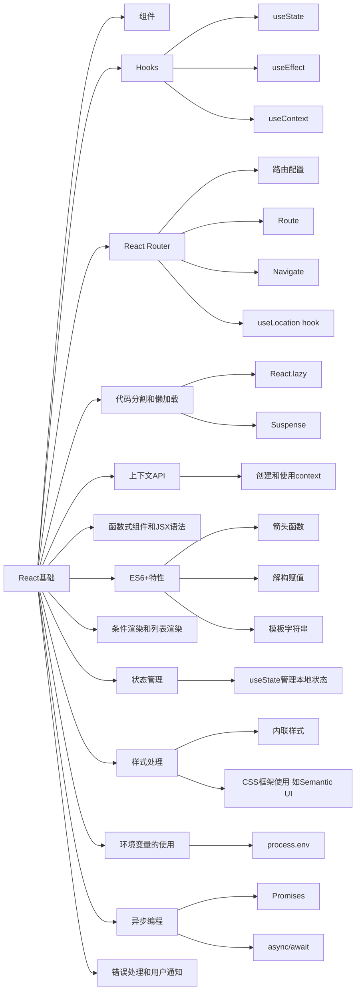
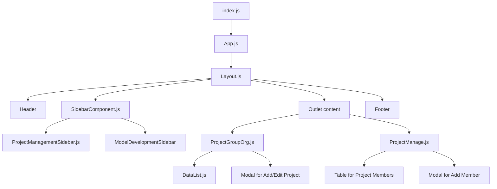
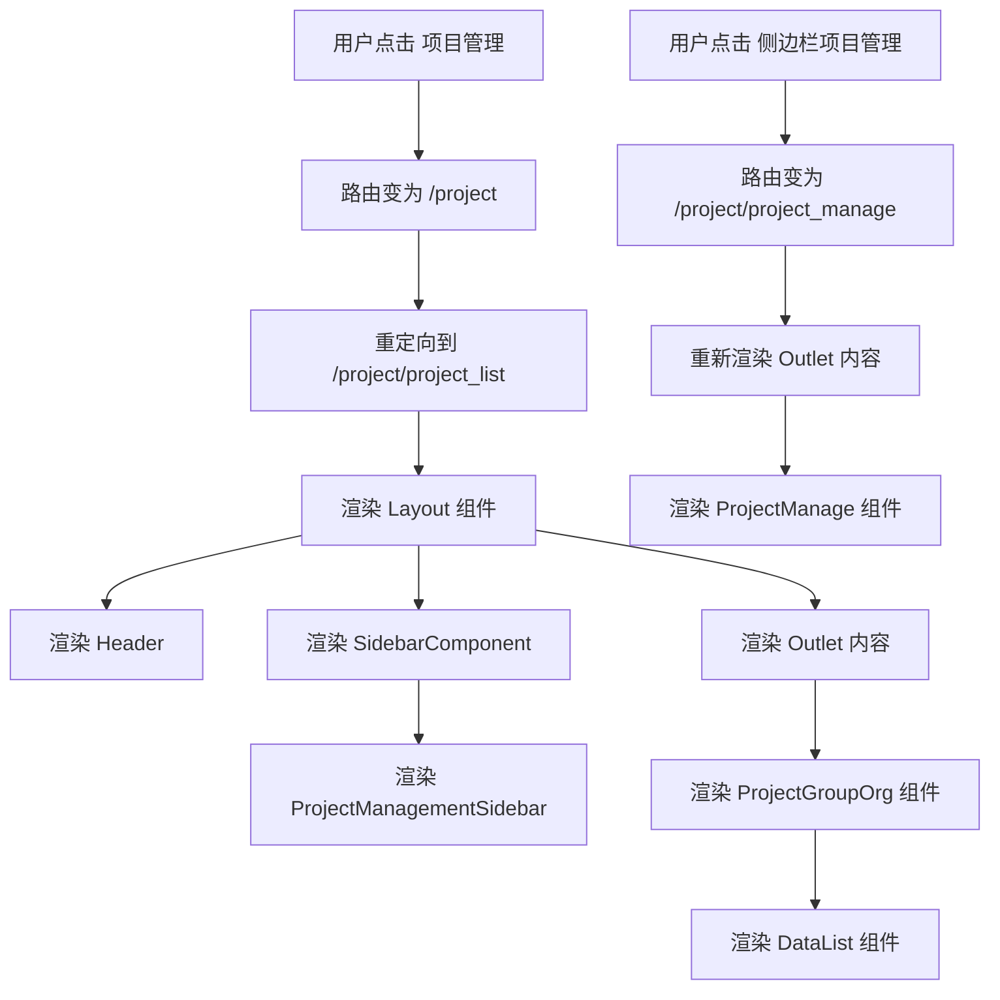
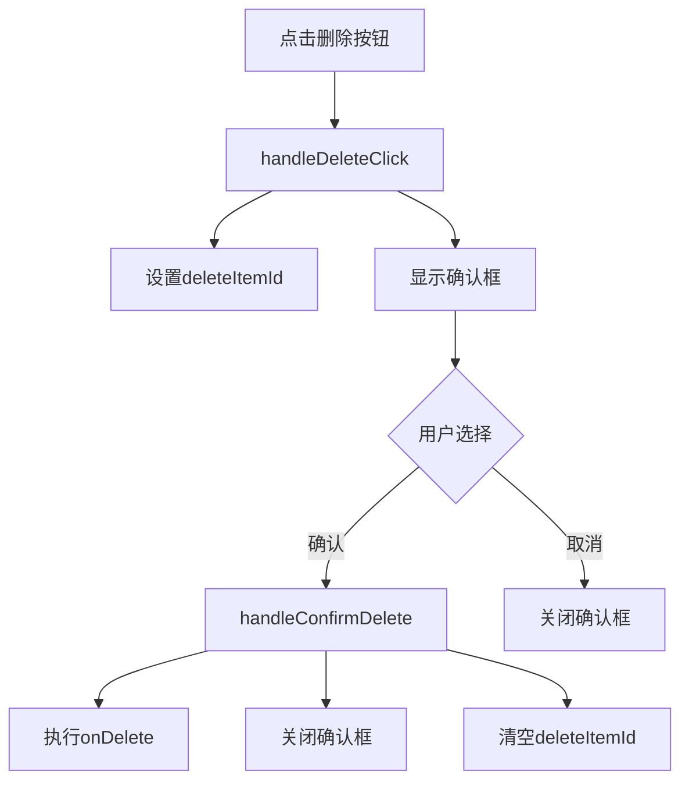
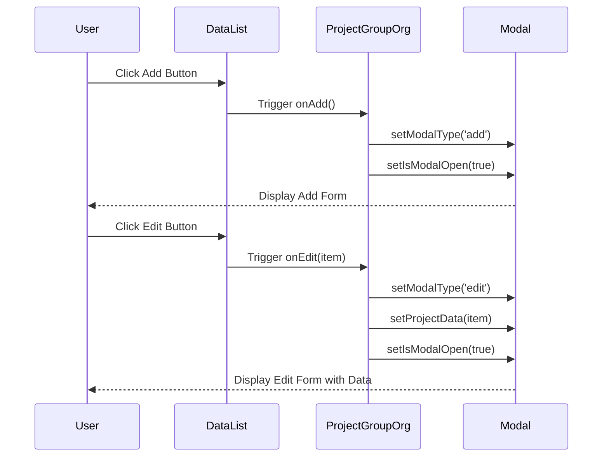
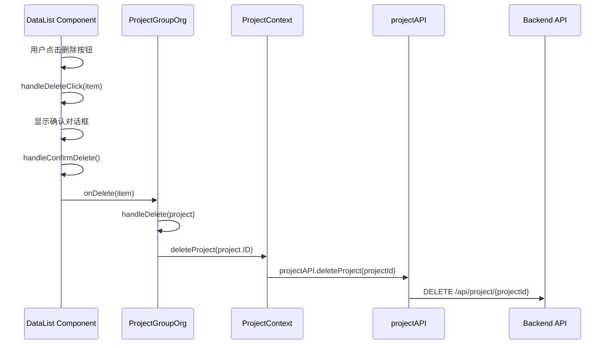
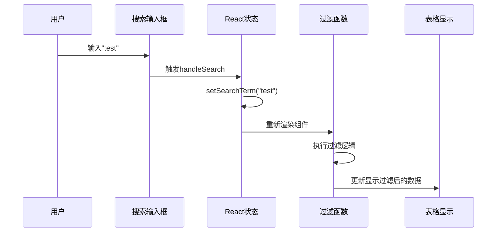

看懂这个项目需要学习的react知识点







是的，这确实是一种非常通用和广泛采用的 React 应用开发方式。这种方法体现了几个重要的 React 和前端开发的最佳实践：

1. 组件化设计：
   将不同的功能封装到独立的组件中（如 ProjectGroupOrg 和 ProjectManage），这提高了代码的可重用性和可维护性。

2. 路由管理：
   使用路由系统（如 React Router）来管理不同的视图，这允许创建单页应用（SPA），提供更流畅的用户体验。

3. 布局复用：
   通过在 Layout 组件中使用 Outlet，可以在保持一致的页面结构（如 header 和 footer）的同时，动态渲染不同的内容。

4. 状态管理：
   使用自定义 hook（如 useProjects）来管理和共享状态，这是 React 推荐的状态管理方式之一，特别适用于中小型应用。

5. 可重用组件：
   像 DataList 这样的通用组件可以在多个地方复用，提高了开发效率。

6. 模态框的使用：
   使用模态框来处理添加/编辑操作是一种常见的 UI 模式，它保持了主界面的简洁性。

7. 关注点分离：
   每个组件负责特定的功能（如项目列表管理和项目成员管理），这使得代码更容易理解和维护。

8. 响应式设计：
   这种结构很容易适应响应式设计，使应用在不同设备上都能良好运行。

这种开发方式的优点包括：

- 代码组织清晰，易于维护和扩展
- 提高了组件的复用性
- 便于实现权限控制（可以在路由层面进行）
- 有利于性能优化（如代码分割和懒加载）
- 便于团队协作，不同开发者可以专注于不同的组件

然而，也要注意一些潜在的注意点：

- 对于非常大型的应用，可能需要考虑更复杂的状态管理解决方案（如 Redux）
- 需要注意性能问题，特别是在处理大量数据或复杂 UI 时
- 随着应用规模的增长，可能需要更细致的代码分割策略

总的来说，这种开发方式是 React 应用开发中的一种常见和有效的模式，特别适合中小型应用和团队。它提供了良好的结构和可扩展性，同时保持了代码的可读性和可维护性。







我来详细解释 DataList 组件与 ProjectGroupOrg 组件之间的 edit 和 add 调用过程。




让我们详细看一下两个主要操作的流程：

1. 添加(Add)操作流程：
```javascript
// 在 DataList 组件中
<Button primary onClick={onAdd}>  
  <Icon name="plus" /> 添加
</Button>

// 当点击添加按钮时，调用传入的 onAdd 方法
// 这个 onAdd 方法实际上是 ProjectGroupOrg 中的 handleAdd：
const handleAdd = () => {
  setModalType('add');  // 设置模态框类型为添加
  setProjectData({ name: '', description: '' });  // 清空表单数据
  setModalError('');  // 清空错误信息
  setIsModalOpen(true);  // 打开模态框
};
```

2. 编辑(Edit)操作流程：
```javascript
// 在 DataList 组件中
<Button icon color="blue" onClick={() => onEdit(item)}>
  <Icon name="edit" />
</Button>

// 当点击编辑按钮时，调用传入的 onEdit 方法并传入当前行数据
// 这个 onEdit 方法实际上是 ProjectGroupOrg 中的 handleEdit：
const handleEdit = (project) => {
  setModalType('edit');  // 设置模态框类型为编辑
  setProjectData({  // 设置表单数据为当前项目数据
    name: project.name, 
    description: project.description 
  });
  setSelectedProjectId(project.id);  // 保存当前编辑项目的ID
  setModalError('');  // 清空错误信息
  setIsModalOpen(true);  // 打开模态框
};
```

数据流传递过程：
1. ProjectGroupOrg 组件将回调函数传给 DataList：
```javascript
<DataList
  title="项目管理"
  data={projects}
  columns={columns}
  onAdd={handleAdd}    // 传入添加处理函数
  onEdit={handleEdit}  // 传入编辑处理函数
  onDelete={handleDelete}
/>
```

2. DataList 组件接收这些函数作为 props：
```javascript
const DataList = ({ title, data, columns, onAdd, onEdit, onDelete }) => {
  // ... 组件内部代码
}
```

3. 当用户点击按钮时：
- 点击添加按钮：直接调用 onAdd()
- 点击编辑按钮：调用 onEdit(item)，并传入当前行数据

4. 这些操作最终都会：
- 设置模态框类型（add/edit）
- 设置/清空表单数据
- 打开模态框

总结：
- 添加操作是一个简单的触发，打开空白表单
- 编辑操作需要传递当前行数据，打开预填充的表单
- 两个操作都通过 props 回调的方式从子组件(DataList)传递到父组件(ProjectGroupOrg)处理
- 最终都通过修改状态来控制模态框的显示和内容

这种设计模式遵循了 React 的单向数据流，通过 props 传递数据和回调函数，实现了组件间的解耦和复用。


**删除功能调用过程**







